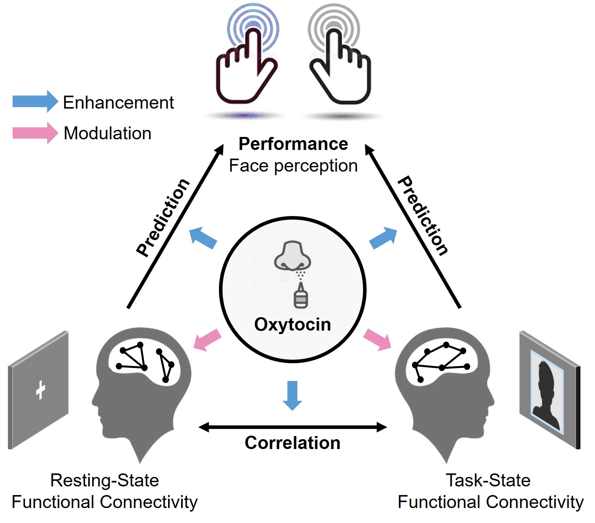

# OT-cpm

> From [Affective, Neuroscience, and Decision-making Lab](https://andlab-um.com)

Code and data for:

Zhang, H., Chen, K., Bao, J., & Wu, H. (2023). **Oxytocin enhances the triangular association among behavioral performance, resting state, and task-state functional connectivity**. *Human Brain Mapping*. https://doi.org/10.1002/hbm.26498

## Abstract
Considerable advances in the role of oxytocin (OT) effect on behavior and the brain network have been made, but the effect of OT on the association between inter-individual differences in functional connectivity (FC) and behavior is elusive. Here, by using a face-perception task and multiple connectome-based predictive models, we aimed to (1) determine whether OT could enhance the association among behavioral performance, resting-state FC (rsFC), and task-state FC (tsFC) and (2) if so, explore the role of OT in enhancing this triangular association. We found that in the OT group, the prediction performance of using rsFC or tsFC to predict task behavior was higher than that of the PL group. Additionally, the correlation coefficient between rsFC and tsFC was substantially higher in the OT group than in the PL group. The strength of these associations could be partly explained by OT altering the brain’s FCs related to social cognition and face perception in both the resting and task states, mainly in brain regions such as the limbic system, prefrontal cortex, temporal poles, and temporoparietal junction. Taken together, these results provide novel evidence and a corresponding mechanism for how neuropeptides cause increased associations among inter-individual differences across different levels (e.g., behavior and large-scale brain networks in both resting and task-state), and may inspire future research on the role of neuropeptides in the cross levels association of both clinical and non-clinical use.

## Keywords
Oxytocin; Functional connectivity; Brain-behavior association; CPM

## File structure

> TODO
